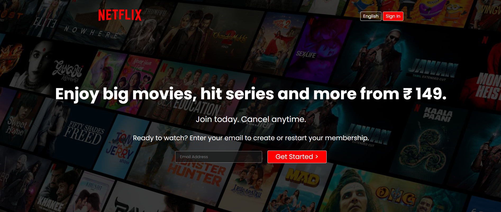
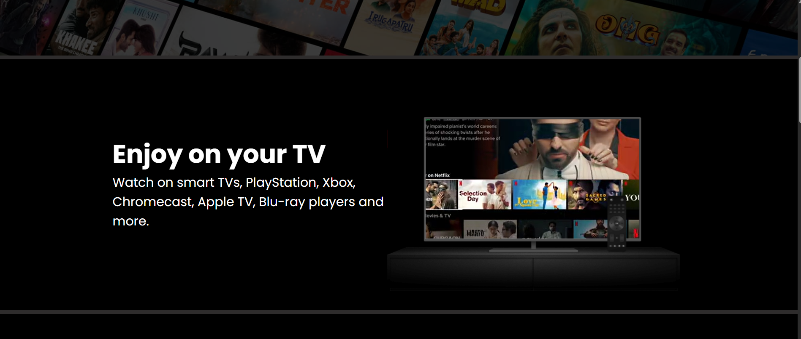
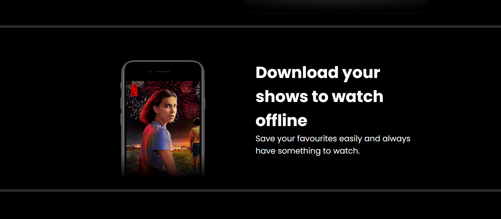
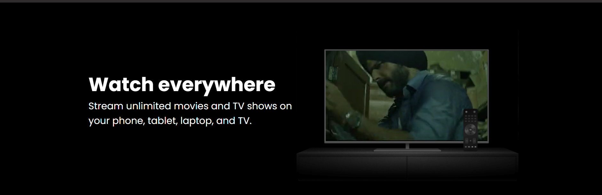
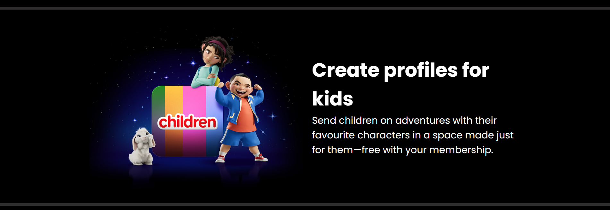
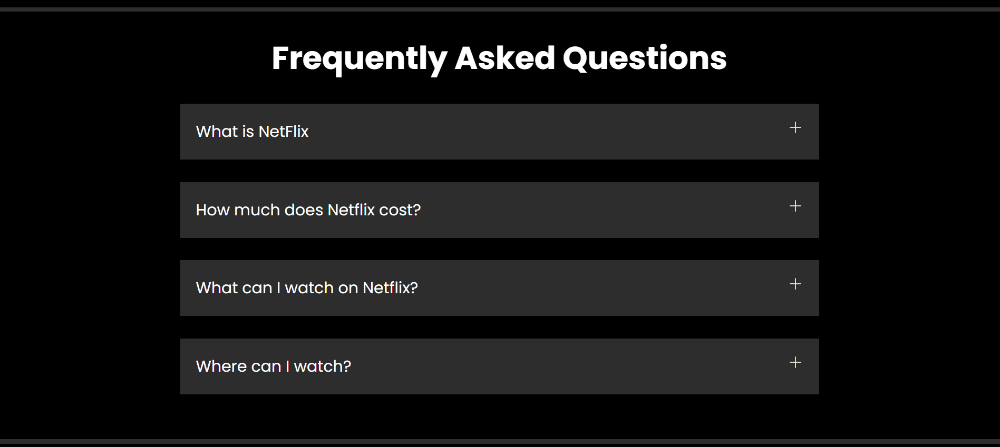
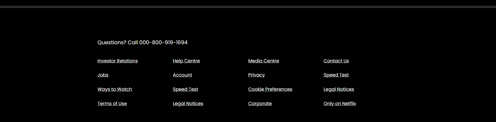

<h1 align = "center">🎬 Netflix Clone</h1>

- A fully responsive clone of Netflix.
- Building this  Web app with intention of learning HTML, CSS better.

---
### ⭐ Show Some Love!

If you like this project, consider starring ⭐ the repo.

---

## 📸 Screenshots

<table border="1">
  <thead>
    <tr>
      <th style="text-align:center;" >1</th>
    </tr>
  </thead>
  <tbody>
    <tr>
      <td></img></td>
    </tr>
  </tbody>
</table>

<table border="1">
  <thead>
    <tr>
      <th style="text-align:center;" >2</th>
      <th style="text-align:center;" >3</th>
    </tr>
  </thead>
  <tbody>
    <tr>
      <td></img></td>
      <td></img></td>
    </tr>
  </tbody>
</table>

<table border="1">
  <thead>
    <tr>
      <th style="text-align:center;" >4</th>
      <th style="text-align:center;" >5</th>
    </tr>
  </thead>
  <tbody>
    <tr>
      <td></img></td>
      <td></img></td>
    </tr>
  </tbody>
</table>

<table border="1">
  <thead>
    <tr>
      <th style="text-align:center;" >6</th>
      <th style="text-align:center;" >7</th>
    </tr>
  </thead>
  <tbody>
    <tr>
      <td></img></td>
      <td></img></td>
    </tr>
  </tbody>
</table>


### License

```
© 2024 Netflix Clone. All Rights Reserved.
```